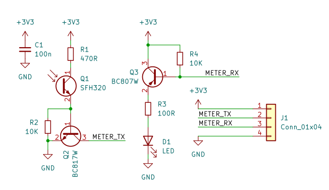
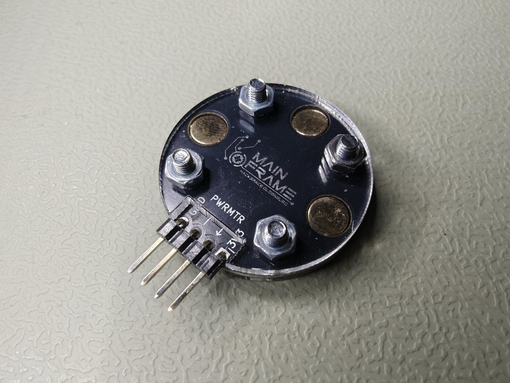
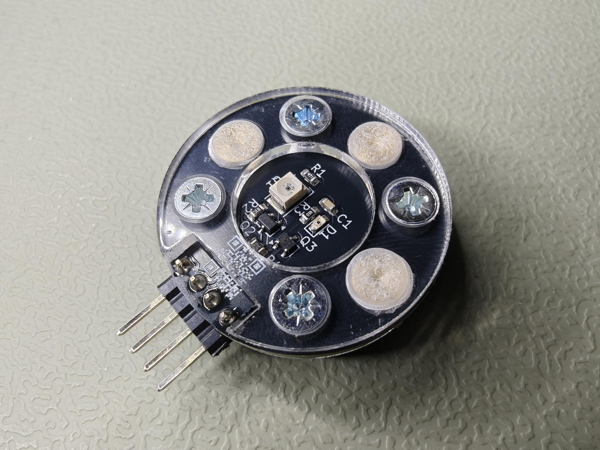

This PCB can be used to read out data from smart meters commonly found in
Germany using their IR interface. It's intended to be used with 3.3V or 5V
serial interfaces, for example with USB UART-TTL adapters (e.g. from FTDI)
or microcontrollers such as the ESP8266 or ESP32 series.

# Schematic

# Pictures

# Software

For initial testing a USB UART-TTL adapter is quite useful. It can be used
to directly check the smart meter output with a laptop. Note that some meters
use a binary protocol called [SML](https://de.wikipedia.org/wiki/Smart_Message_Language)
(Smart Message Language). On Debian `sml_server` (from
[libsml-utils](https://packages.debian.org/trixie/libsml-utils) package) can be
used to decode it.
